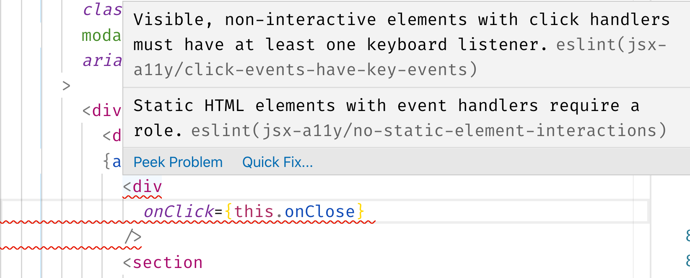
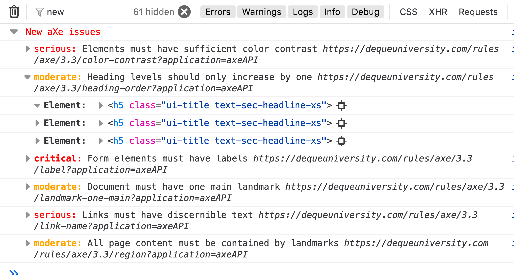

# Tooling

## Linter [eslint-plugin-jsx-a11y](https://github.com/evcohen/eslint-plugin-jsx-a11y)



## Dev tool logger using [react-axe](https://github.com/dequelabs/react-axe)

```js
//webpack config
plugins: [
  new webpack.DefinePlugin({
    ...
    SHOW_A11Y_LOGGER: JSON.stringify(
      ENV !== 'production' &&
      process.env.ENABLE_A11Y === '1'
      ),
  }),
  ...
],


//index.js/root component
componentDidUpdate(...) {
  if(SHOW_A11Y_LOGGER) {
    axe(React, ReactDOM, 1000); //react-axe
  }
}

//before
> npm start

//with logger
> ENABLE_A11Y=1 npm start
```



## Unit Testing

### Using [enzyme-chai-a11y](https://github.com/interviewstreet/enzyme-chai-a11y)

```js
import auditA11y, { accessible } from "enzyme-chai-a11y";
chai.use(accessible);

it("should not have accessibility violations", async () => {
  const results = await auditA11y(<p>test</p>);
  expect(results).to.be.accessible();
});
```

### Using [axe-core](https://github.com/dequelabs/axe-core)

```js
async function runAxe(node, config) {
  try {
    const results = await axeCore.run(node, config); //axe-core
    return results;
  } catch (error) {
    throw error;
  }
}

async function auditA11y(app, config = {}, enzymeConfig = {}) {
  const wrapper = mount(app, enzymeConfig);
  const node = wrapper.getDOMNode();

  const results = await runAxe(node, config);

  wrapper.unmount();
  return results;
}

function accessible(chai) {
  chai.Assertion.addMethod("accessible", function() {
    const { violations } = this._obj;
    const audit = new chai.Assertion(violations);
    const pass = violations.length === 0;

    audit.assert(
      pass,
      logVioloations(violations) //custom logger
    );
  });
}

chai.use(accessible);

//use:
it("should not violate any a11y rules", async () => {
  const results = await auditA11y(<Button>Test</Button>);
  expect(results).to.be.accessible();
});
```
